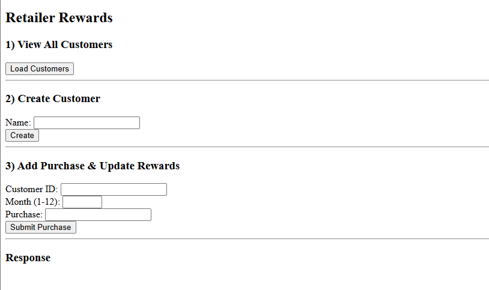

# Getting Started
This project is to demo a retailer-rewards project.


## Endpoints
- GET get all customers ```/retailer-rewards/customers```
- POST create a customer ```/retailer-rewards/customer```
- POST add a purchase and update rewards ```/retailer-rewards/rewards/{id}```

## DEPENDENCIES
- Java 17
- Springboot
- Spring Data JPA
- Spring Web
- H2 DB
- lombok
